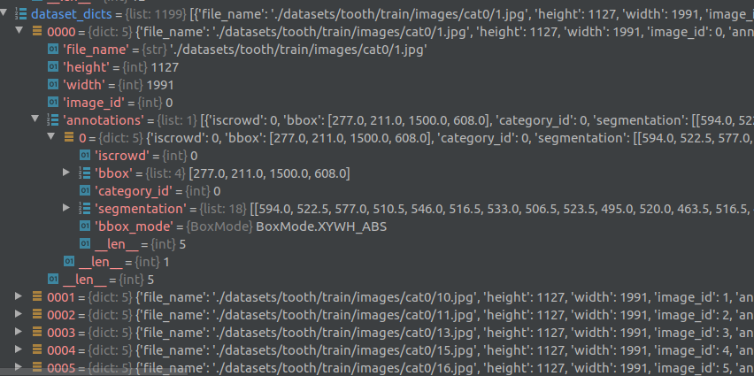
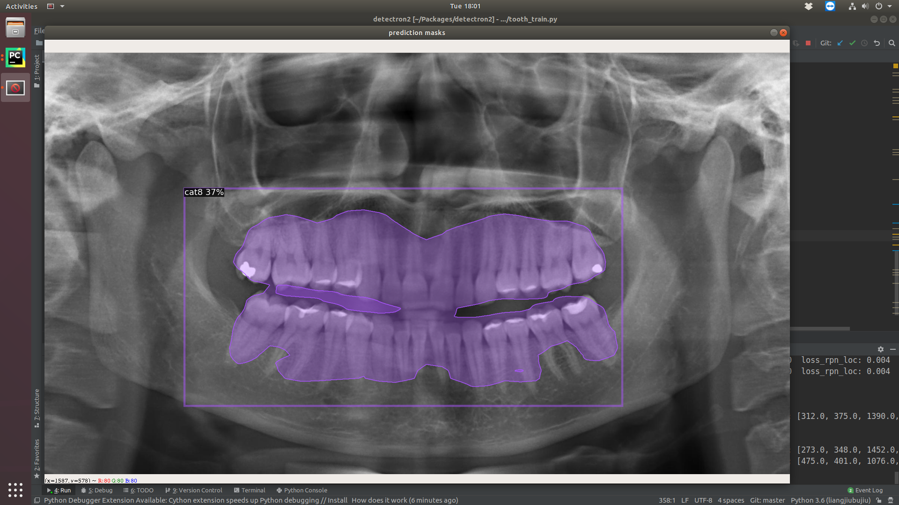

# Tracking and detection

several preliminary experiments for videl tracking task.

# Tracking
## Installation Requirements
* Linux (Ubuntu 18)
* Python ≥ 3.6
* Opencv-contrib-python > 4.1.0 recommended

Take CSRT algorithm as an example, run tracking.py with:

```
python tracking.py --video tracking.mp4 --algorithm CSRT
```
## Dataset for Tracking 
Dataset is from [deep-dental-image](https://github.com/IvisionLab/deep-dental-image).


# Detection
All the preliminary experiments are based on pretrained models and opensource packages.
## Installation Requirements
* Cuda 10.1 [guidance 1](https://medium.com/@exesse/cuda-10-1-installation-on-ubuntu-18-04-lts-d04f89287130) [guidance 2](https://oldtang.com/2486.html) [guidance3](http://blog.jeffhaluska.com/adventures-in-installing-pytorch-in-ubuntu-18-04/).
* Facebook [detectron 2](https://github.com/facebookresearch/detectron2).
* Git [shape_to_coco](https://github.com/waspinator/pycococreator) to path /detectron2/.

  tips:
  - Driver, cuda and pytorch should be matched perfectly. 

  - Create new conda env to manage this repository.
```
conda create -n mypython3 python=3.6
conda activate mypython3
conda info --envs
conda list
conda deactivate
```
## Dataset for Detection
Contact with [UFBA_UESC_DENTAL_IMAGES_DEEP ](https://github.com/IvisionLab/deep-dental-image).



## Start 
* copy all the .py files to detectron/, rename tooth dataset and put it to detectron/dataset/.
* generate train and val dataset from the original UFBA_UESC_DENTAL_IMAGES_DEEP dataset.
```
cd detectron2
python division_train_val.py
```
* generate annotation .json files for train and val datasets seperately. waiting for 15 minutes to generate two json files.
```
python shape_to_coco.py
```
* run tooth_train.py to train and evaluate the detection performance.
## Results 
Simply use the MASKRCNN pretrained model and [guideance](https://www.dlology.com/blog/how-to-train-detectron2-with-custom-coco-datasets/).
Predited categories and segmentation annotations are not ideal.
{: height="100" width="100"}.



Ps: All therepository is made by the detailed markdown [guidance](https://guides.github.com/features/mastering-markdown/)
